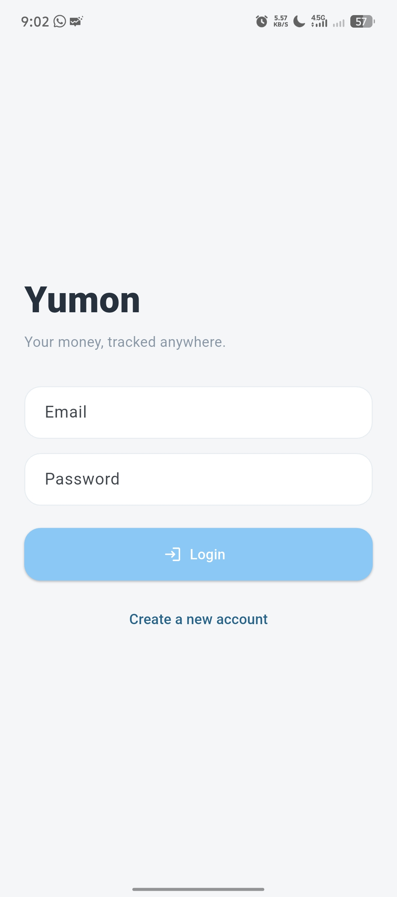
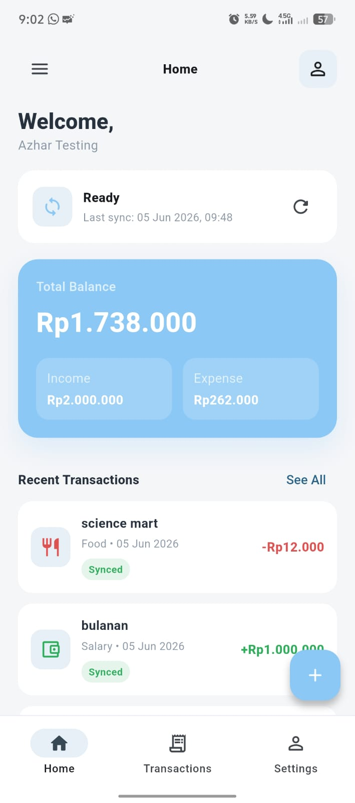
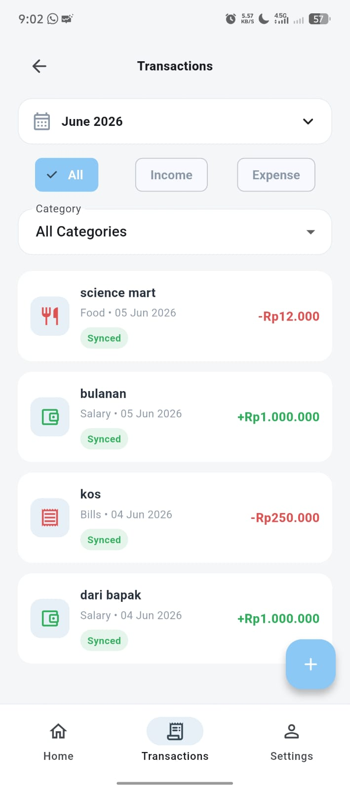

# Yumon — Offline-First Personal Finance App

Yumon adalah aplikasi pencatat keuangan pribadi untuk mencatat pemasukan dan pengeluaran harian. Aplikasi ini dirancang dengan pendekatan **offline-first**, sehingga pengguna tetap dapat menambah, melihat, mengedit, dan menghapus transaksi walaupun perangkat sedang tidak terhubung ke internet.

Data transaksi disimpan terlebih dahulu di local database menggunakan **IsarDB**. Ketika perangkat kembali online, pengguna dapat melakukan sinkronisasi agar perubahan lokal dikirim ke backend dan data terbaru dari server ditarik kembali ke aplikasi.

Project ini dibuat untuk tugas **MobTeam #2 — Backend & Local Database** dengan studi kasus **Aplikasi Manajemen Keuangan Pribadi**.

---

## Wireframe

<p align="center">
  
  
  
</p>

---

## Links

| Kebutuhan | Link |
|---|---|
| Backend Production Endpoint | https://yumon-api.vercel.app/ |
| API Base URL | https://yumon-api.vercel.app/api |
| Dokumentasi API Postman | https://documenter.getpostman.com/view/13069443/2sBXwpPX76 |

---

## Fitur Utama

### Frontend Mobile

- Register dan login user.
- Penyimpanan token JWT menggunakan `flutter_secure_storage`.
- CRUD transaksi lokal menggunakan IsarDB.
- Pencatatan transaksi pemasukan dan pengeluaran.
- Kategori transaksi, seperti Food, Transport, Salary, College, Shopping, Entertainment, dan lainnya.
- Filter transaksi berdasarkan bulan, tipe transaksi, dan kategori.
- Ringkasan saldo bulanan:
  - Total pemasukan
  - Total pengeluaran
  - Saldo
- Offline mode.
- Manual sync melalui tombol sync di aplikasi.
- Sinkronisasi dua arah:
  - Push perubahan lokal ke backend
  - Pull data terbaru dari backend ke IsarDB

### Backend API

- Register dan login user.
- Autentikasi JWT.
- Endpoint user aktif melalui `/auth/me`.
- REST API transaksi:
  - `GET /transactions`
  - `POST /transactions`
  - `PUT /transactions/:id`
  - `DELETE /transactions/:id`
- Endpoint sync push:
  - `POST /sync/push`
- Penyimpanan data transaksi berdasarkan user.

---

## Tech Stack

### Frontend Mobile

| Kebutuhan | Teknologi |
|---|---|
| Framework | Flutter |
| Language | Dart |
| State Management | Riverpod |
| Routing | go_router |
| Local Database | IsarDB |
| HTTP Client | Dio |
| Secure Storage | flutter_secure_storage |
| Connectivity Check | connectivity_plus |
| ID Generator | uuid |
| Date/Currency Formatting | intl |

### Backend

| Kebutuhan | Teknologi |
|---|---|
| Runtime | Node.js |
| Framework | Express.js |
| Database | PostgreSQL |
| Database Hosting | Neon |
| Backend Deployment | Vercel |
| Authentication | JWT |
| API Style | REST API |
| API Documentation | Postman Documentation |

---

## Arsitektur Sistem

Yumon menggunakan arsitektur berlapis agar frontend, local database, remote API, dan sync logic memiliki tanggung jawab yang jelas.

```text
Flutter Mobile App
├── Presentation Layer
│   ├── Login Screen
│   ├── Register Screen
│   ├── Home Screen
│   ├── Transaction List Screen
│   ├── Add/Edit Transaction Screen
│   └── Settings / Sync Screen
│
├── State Management Layer
│   └── Riverpod Providers / Controllers
│
├── Repository Layer
│   ├── Auth Repository
│   └── Transaction Repository
│
├── Data Source Layer
│   ├── Local Data Source: IsarDB
│   └── Remote Data Source: REST API with Dio
│
└── Sync Layer
    └── Push local changes and pull server data
```

```text
Backend API
├── Auth Routes
│   ├── POST /auth/register
│   ├── POST /auth/login
│   └── GET /auth/me
│
├── Transaction Routes
│   ├── GET /transactions
│   ├── POST /transactions
│   ├── PUT /transactions/:id
│   └── DELETE /transactions/:id
│
├── Sync Routes
│   └── POST /sync/push
│
└── PostgreSQL Database
    ├── Users
    └── Transactions
```

---

## Alur Offline-First

Yumon menjadikan **IsarDB sebagai sumber data utama di aplikasi mobile**. Artinya, data yang ditampilkan ke user berasal dari local database terlebih dahulu, bukan langsung dari API.

Alur utamanya:

1. User menambah, mengedit, atau menghapus transaksi melalui aplikasi.
2. Perubahan disimpan terlebih dahulu ke IsarDB.
3. Setiap transaksi memiliki status sinkronisasi.
4. Ketika user menekan tombol sync, aplikasi akan:
   - Mengecek koneksi internet.
   - Mengecek token login.
   - Mengirim perubahan lokal ke backend.
   - Mengambil data terbaru dari backend.
   - Menyimpan hasil sinkronisasi ke IsarDB.

Status sinkronisasi yang digunakan:

| Status | Keterangan |
|---|---|
| `synced` | Data lokal sudah sama dengan server |
| `pendingCreate` | Data baru dibuat di lokal dan belum dikirim ke server |
| `pendingUpdate` | Data lokal diedit dan belum dikirim ke server |
| `pendingDelete` | Data lokal dihapus dan belum dikirim ke server |
| `failed` | Proses sync sebelumnya gagal |

---

## Cara Menjalankan Frontend Flutter

### Prasyarat

Pastikan sudah menginstall:

- Flutter SDK
- Dart SDK
- Android Studio
- Android SDK
- Android Emulator atau device Android fisik
- Git

Cek environment Flutter:

```bash
flutter doctor -v
```

Masuk ke folder frontend:

```bash
cd app
```

Install dependency:

```bash
flutter pub get
```

Generate file Isar:

```bash
dart run build_runner build --delete-conflicting-outputs
```

Format kode:

```bash
dart format lib
```

Cek error:

```bash
flutter analyze
```

Jalankan aplikasi:

```bash
flutter run
```

### Menjalankan dengan API Production

```bash
flutter run --dart-define=API_BASE_URL=https://yumon-api.vercel.app/api
```

### Menjalankan dengan Fake Auth Mode

Secara default aplikasi menggunakan backend asli. Untuk menjalankan mode fake auth saat development:

```bash
flutter run --dart-define=YUMON_FAKE_AUTH=true
```

---

## Cara Build APK

Masuk ke folder frontend:

```bash
cd app
```

Build APK release:

```bash
flutter build apk --release --dart-define=API_BASE_URL=https://yumon-api.vercel.app/api
```

Hasil build APK berada di:

```text
build/app/outputs/flutter-apk/app-release.apk
```

Build APK debug:

```bash
flutter build apk --debug --dart-define=API_BASE_URL=https://yumon-api.vercel.app/api
```

Hasil build debug berada di:

```text
build/app/outputs/flutter-apk/app-debug.apk
```

---

## Konfigurasi Android Build

Pada environment pengembangan tim, beberapa dependency native membutuhkan versi Android SDK dan Gradle yang sesuai.

Konfigurasi yang digunakan:

| Komponen | Versi |
|---|---|
| compileSdk | 36 |
| targetSdk | 35 |
| Android Gradle Plugin | 8.9.1 |
| Gradle Wrapper | 8.11.1 |

Catatan untuk Windows:

- Aktifkan Developer Mode agar Flutter dapat membuat symlink.
- Pastikan Android SDK Platform 34, 35, dan 36 tersedia melalui SDK Manager.
- Pastikan Android SDK Build-Tools sudah terinstall.

---

## Pembagian Tugas Tim

### Azhar

- Mengembangkan frontend Flutter.
- Membuat tampilan aplikasi Yumon.
- Membuat halaman login dan register.
- Mengintegrasikan auth frontend dengan backend.
- Membuat CRUD transaksi lokal menggunakan IsarDB.
- Membuat fitur filter transaksi.
- Membuat ringkasan pemasukan, pengeluaran, dan saldo.
- Mengintegrasikan transaksi frontend dengan REST API backend.
- Mengimplementasikan sync dari sisi aplikasi.
- Melakukan testing aplikasi di emulator/device Android.
- Membuat build APK untuk demo.

### Iqbal

- Mengembangkan backend REST API.
- Membuat endpoint autentikasi:
  - Register
  - Login
  - Me
- Membuat endpoint transaksi:
  - GET
  - POST
  - PUT
  - DELETE
- Membuat endpoint sync push.
- Mengatur database PostgreSQL.
- Mengatur relasi data user dan transaksi.
- Mengimplementasikan autentikasi JWT.
- Melakukan deployment backend ke Vercel.
- Membuat dokumentasi API menggunakan Postman.
- Melakukan testing endpoint menggunakan Postman.

---

## Alur Demo

Urutan demo yang disarankan:

1. Buka aplikasi Yumon.
2. Register akun baru.
3. Login menggunakan akun tersebut.
4. Tambahkan transaksi pemasukan.
5. Tambahkan transaksi pengeluaran.
6. Lihat ringkasan saldo di halaman utama.
7. Lihat daftar transaksi.
8. Gunakan filter transaksi berdasarkan tipe atau kategori.
9. Tambahkan transaksi saat belum melakukan sync.
10. Klik tombol Sync.
11. Tunjukkan data berhasil masuk ke backend.
12. Edit transaksi lalu sync.
13. Hapus transaksi lalu sync.
14. Tutup aplikasi dan buka kembali untuk menunjukkan data tetap tersimpan.

---

## Status Project

Status akhir project:

- Frontend Flutter sudah terintegrasi dengan backend.
- Auth register, login, dan JWT token sudah berjalan.
- CRUD transaksi lokal dengan IsarDB sudah berjalan.
- REST API transaksi sudah terhubung.
- Sync push dan pull sudah berjalan.
- APK dapat dibuild untuk testing dan demo.
- Project memenuhi konsep offline-first personal finance tracker.